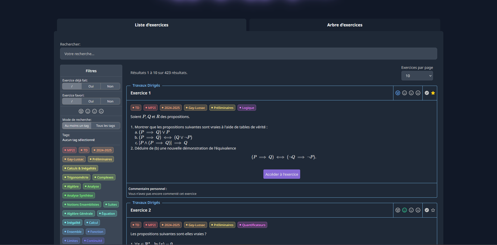

# 🎓 PrepaLib – Revision Platform

## 📝 Description
PrepaLib is a web application designed to help students prepare for **competitive entrance exams** (French major engineering schools).  
It allows users to:
- Learn from **courses** 📚
- Practice **exercises** with hints ✍️
- Add **personal comments** 🗒️ to remember key details
- Set **difficulty level** ⭐ to exercises in order to review them later

The platform is currently available at:  
👉 [PrepaLib](https://prepalib.arkean.fr)

---

## 🖼️ Screenshot

---

## 🚀 Features
- 📝 Remember what's important with personal notes / comments and difficulty level
- 🔎 Search & filter content easily with rich tagging system
- 🖥️ Modern and responsive design (Optimized for large screens)
- 🔐 Secure user accounts (Symfony-based authentication)

---

## 🛠️ Tech Stack
- **Backend:** Symfony (PHP)
- **Frontend:** Twig / HTML / CSS / JS
- **Database:** MySQL / MariaDB using Doctrine
- **Deployment:** Apache
- **Admin tools:**
    - LaTeX editor ✍️ (for mathematical formulas and structured content)
    - Role-based administration system 🔑

---
